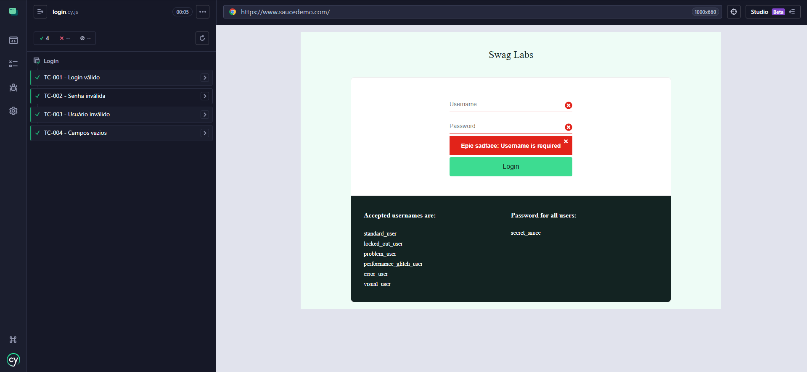
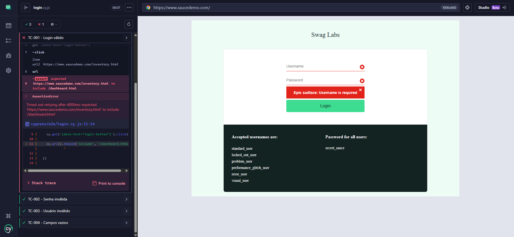

# QA Automation Cypress — SauceDemo


---

> **Note / Nota:** This README is bilingual. The **Portuguese (Brazil)** version is presented first, followed by the **English (US)** version.  
> Este README é bilíngue. A versão em **Português (Brasil)** é apresentada primeiro, seguida pela versão em **Inglês (EUA)**.

---

<br>

---

## Destaque do Projeto / Project Highlight

**Português:** Este repositório demonstra meu primeiro projeto de automação de testes utilizando Cypress. O projeto inclui:
- Automação de login
- Casos de teste documentados
- Evidências de execução
- Simulação de defeitos
- Controle de versão com Git

**English:** This repository demonstrates my first QA Automation project using Cypress. The project includes:
- Login automation
- Documented test cases
- Execution evidence
- Defect simulation
- Git version control

---

<br>

# PORTUGUÊS (BRASIL)

---

## Sumário

1. [Visão Geral do Projeto](#visão-geral-do-projeto)
2. [Objetivos do Projeto](#objetivos-do-projeto)
3. [Stack Tecnológico](#stack-tecnológico)
4. [Estrutura do Projeto](#estrutura-do-projeto)
5. [Casos de Teste Automatizados](#casos-de-teste-automatizados)
6. [Conceitos de QA Aplicados](#conceitos-de-qa-aplicados)
7. [Fluxo de Execução dos Testes](#fluxo-de-execução-dos-testes)
8. [Simulação de Defeito](#simulação-de-defeito)
9. [Evidências Visuais](#evidências-visuais)
10. [Evidências e Documentação](#evidências-e-documentação)
11. [Lições Aprendidas](#lições-aprendidas)
12. [Melhorias Futuras](#melhorias-futuras)
13. [Como Executar o Projeto](#como-executar-o-projeto)
14. [Versão](#versão)
15. [Sobre o Autor](#sobre-o-autor)

---

## Visão Geral do Projeto

Este repositório apresenta um projeto de **automação de testes end-to-end** desenvolvido com **Cypress** e **JavaScript**, utilizando a aplicação [SauceDemo](https://www.saucedemo.com/) como alvo de testes.

O projeto foi concebido como um portfólio técnico de QA, com o objetivo de demonstrar competências práticas em:

- Análise e design de casos de teste
- Automação de testes com Cypress
- Documentação de QA estruturada
- Gerenciamento de evidências de teste
- Simulação e reporte de defeitos

A aplicação sob teste (AUT) é o SauceDemo — uma plataforma de e-commerce de demonstração amplamente utilizada em projetos de automação — cujo módulo de autenticação foi selecionado como escopo desta primeira fase de cobertura.

---

## Objetivos do Projeto

| # | Objetivo |
|---|----------|
| 1 | Praticar automação E2E com o framework Cypress |
| 2 | Criar e documentar casos de teste com cenários positivos e negativos |
| 3 | Documentar casos de teste de forma organizada e rastreável |
| 4 | Simular um cenário de falha intencional para praticar coleta de evidências |
| 5 | Organizar evidências de execução (screenshots) de maneira estruturada |
| 6 | Construir um portfólio técnico com controle de versão via Git |

---

## Stack Tecnológico

| Tecnologia | Versão | Finalidade |
|------------|--------|------------|
| [Cypress](https://www.cypress.io/) | Latest | Framework de automação de testes E2E |
| [JavaScript](https://developer.mozilla.org/en-US/docs/Web/JavaScript) | ES6+ | Linguagem de programação dos testes |
| [Node.js](https://nodejs.org/) | LTS | Ambiente de execução JavaScript |
| [SauceDemo](https://www.saucedemo.com/) | — | Aplicação sob teste (AUT) |

---

## Estrutura do Projeto

```
qa-automation-cypress-saucedemo/
├── cypress/
│   ├── e2e/
│   │   └── login.cy.js          # Especificações de teste (casos de teste automatizados)
│   ├── fixtures/                 # Dados de teste estáticos (massa de dados)
│   └── support/                  # Comandos customizados e configurações de suporte
├── docs/
│   ├── QA_Test_Cases_Cypress_Login_Project.xlsx   # Planilha de casos de teste
│   └── screenshots/
│       ├── passed-test.png       # Evidência de execução bem-sucedida
│       └── failed-test.png       # Evidência de falha intencional
├── cypress.config.js             # Arquivo de configuração do Cypress
├── package.json                  # Dependências e scripts do projeto
├── package-lock.json             # Lockfile de dependências
├── .gitignore                    # Arquivos ignorados pelo controle de versão
└── README.md                     # Documentação do projeto
```

**Descrição dos diretórios principais:**

- `cypress/e2e/` — Contém os arquivos de especificação (`.cy.js`) com os casos de teste implementados. Cada arquivo representa um conjunto de testes agrupado por funcionalidade.
- `cypress/fixtures/` — Armazena dados de entrada estáticos utilizados durante a execução dos testes.
- `cypress/support/` — Local destinado a comandos Cypress customizados e hooks globais (`before`, `beforeEach`, etc.).
- `docs/` — Centraliza toda a documentação de QA do projeto, incluindo a planilha de casos de teste e as evidências de execução.

---

## Casos de Teste Automatizados

Os casos de teste foram desenhados para cobrir os cenários positivos e negativos da funcionalidade de login do SauceDemo, com foco em automação E2E e coleta de evidências.

| ID | Título | Tipo | Dado de Entrada | Resultado Esperado | Status |
|----|--------|------|-----------------|-------------------|--------|
| TC-001 | Login com credenciais válidas | Caminho Feliz | `standard_user` / senha correta | Redirecionamento para a página de produtos |  |
| TC-002 | Login com senha inválida | Caminho Negativo | `standard_user` / senha incorreta | Exibição de mensagem de erro de autenticação |  |
| TC-003 | Login com usuário inexistente | Caminho Negativo | Usuário não cadastrado / senha qualquer | Exibição de mensagem de erro de autenticação |  |
| TC-004 | Submissão de formulário com campos vazios | Validação de Campo | Campos em branco | Exibição de mensagens de validação obrigatória |  |
| TC-005 | Cenário de falha intencional | Simulação de Defeito | `standard_user` / senha correta | Asserção deliberadamente incorreta para evidenciar falha |  |

> **Nota sobre TC-005:** A falha no TC-005 é **proposital e documentada**. Seu objetivo é demonstrar a capacidade de identificar, reproduzir e evidenciar defeitos — habilidade fundamental para qualquer profissional de QA. Veja a seção [Simulação de Defeito](#simulação-de-defeito) para detalhes.

---

## Conceitos de QA Aplicados

Este projeto demonstra a aplicação prática dos seguintes fundamentos de Quality Assurance:

**Design de Testes**
- Cobertura de cenários positivos (caminho feliz) e negativos (entradas inválidas)
- Identificação de casos de teste relevantes para o módulo de autenticação

**Automação E2E com Cypress**
- Estruturação de suítes de teste com `describe` e `it` blocks
- Uso de seletores para interação com elementos da interface
- Asserções com o mecanismo nativo do Cypress (Chai)

**Documentação de Casos de Teste**
- Casos de teste documentados em formato tabular com IDs únicos
- Mapeamento entre caso de teste, resultado obtido e evidência de execução

**Simulação de Defeitos e Coleta de Evidências**
- Falha intencional implementada para demonstrar o registro de um defeito
- Screenshots coletadas como evidência de execução (passou e falhou)

**Controle de Versão com Git**
- Organização do repositório com separação entre código de teste, dados e documentação
- Versionamento dos artefatos de QA junto ao código

---

## Fluxo de Execução dos Testes

O diagrama abaixo representa o fluxo adotado neste projeto, do design à execução e reporte:

```
[Análise de Requisitos]
         |
         v
[Design dos Casos de Teste]
         |
         v
[Documentação em Planilha (.xlsx)]
         |
         v
[Implementação dos Testes em Cypress]
         |
         v
[Execução dos Testes]
         |
    _____|_____
   |           |
[PASSED]    [FAILED]
   |           |
   v           v
[Screenshot] [Screenshot + Reporte de Defeito]
         |
         v
[Commit das Evidências no Repositório]
```

---

## Simulação de Defeito

### Propósito

O **TC-005** foi implementado com uma **falha intencional e controlada** para demonstrar uma competência central do trabalho de QA: a capacidade de identificar, isolar e documentar um defeito de forma clara e reproduzível.

### Implementação

No TC-005, após a execução de um login bem-sucedido com credenciais válidas, o teste realiza uma **asserção propositalmente incorreta** — verificando uma condição que o sistema não satisfará. Isso simula o comportamento de um defeito real onde o resultado obtido diverge do resultado esperado.

### Evidências

| Evidência | Arquivo | Descrição |
|-----------|---------|-----------|
| Execução com sucesso | `docs/screenshots/passed-test.png` | Captura do Cypress Runner com todos os testes aprovados (exceto TC-005) |
| Falha intencional | `docs/screenshots/failed-test.png` | Captura evidenciando a falha do TC-005, com stack trace visível |

### Valor para o Avaliador

Um profissional de QA não é avaliado apenas por suítes de teste que "passam". A capacidade de **detectar regressões**, **identificar comportamentos inesperados** e **comunicar defeitos de forma rastreável** é igualmente — ou mais — relevante em ambientes de desenvolvimento ágil.

---

## Evidências Visuais

As imagens abaixo apresentam o resultado da execução dos testes no Cypress Runner.

### Cenário Aprovado — TC-001 a TC-004



> Captura de tela evidenciando a execução bem-sucedida dos casos de teste TC-001 a TC-004.

### Cenário com Falha Intencional — TC-005



> Captura de tela evidenciando a falha controlada do TC-005, com stack trace visível para fins de documentação de defeito.

---

## Evidências e Documentação

Todos os artefatos de QA estão centralizados no diretório `docs/`:

| Artefato | Localização | Conteúdo |
|----------|-------------|----------|
| Planilha de Casos de Teste | `docs/QA_Test_Cases_Cypress_Login_Project.xlsx` | Casos de teste com ID, pré-condições, passos, resultado esperado e status |
| Evidência de Sucesso | `docs/screenshots/passed-test.png` | Screenshot da execução com testes aprovados |
| Evidência de Falha | `docs/screenshots/failed-test.png` | Screenshot da falha intencional no TC-005 |

---

## Lições Aprendidas

Durante o desenvolvimento deste projeto, as seguintes percepções foram consolidadas:

- **Seletores robustos são críticos:** A escolha de seletores CSS e atributos `data-*` impacta diretamente na estabilidade e manutenibilidade dos testes ao longo do tempo.
- **A documentação é parte do entregável de QA:** Testes sem documentação rastreável reduzem o valor do trabalho de automação. A planilha de casos de teste complementa o código.
- **Falhas controladas têm valor pedagógico e profissional:** Saber quando e por que um teste falha é tão importante quanto saber por que ele passa.
- **Organização do repositório reflete maturidade profissional:** A separação entre código, dados e documentação facilita a colaboração e a revisão por pares.
- **O escopo bem delimitado é melhor que uma cobertura superficial ampla:** Cobrir bem um módulo específico demonstra mais rigor técnico do que cobrir muitos módulos de forma incompleta.

---

## Melhorias Futuras

| Prioridade | Melhoria | Justificativa |
|------------|----------|---------------|
| Alta | Implementar Page Object Model (POM) | Aumentar a reusabilidade e manutenibilidade do código de teste |
| Alta | Expandir cobertura para o módulo de carrinho e checkout | Ampliar o escopo de validação da aplicação |
| Média | Integrar com GitHub Actions para execução em CI/CD | Automatizar a execução dos testes a cada push/PR |
| Média | Adicionar relatório de teste com Mochawesome ou Allure | Gerar relatórios HTML ricos para stakeholders não técnicos |
| Baixa | Implementar fixtures para gerenciamento centralizado de dados de teste | Desacoplar dados de teste do código de automação |
| Baixa | Adicionar testes de acessibilidade com `cypress-axe` | Incorporar critérios de qualidade não funcionais |

---

## Como Executar o Projeto

### Pré-requisitos

- [Node.js](https://nodejs.org/) (versão LTS recomendada)
- [Git](https://git-scm.com/)

### Instalação

```bash
# 1. Clonar o repositório
git clone https://github.com/kskios/qa-automation-cypress-saucedemo.git

# 2. Acessar o diretório do projeto
cd qa-automation-cypress-saucedemo

# 3. Instalar as dependências
npm install
```

### Execução dos Testes

```bash
# Abrir o Cypress Test Runner (modo interativo — recomendado para visualização)
npx cypress open

# Executar todos os testes em modo headless (linha de comando)
npx cypress run

# Executar um arquivo de teste específico em modo headless
npx cypress run --spec "cypress/e2e/login.cy.js"

# Executar testes com geração de vídeo e screenshots
npx cypress run --spec "cypress/e2e/login.cy.js" --headed
```

### Resultado Esperado da Execução

```
  Login Tests - SauceDemo
    ✓ TC-001: Valid Login (2000ms)
    ✓ TC-002: Invalid Password (1500ms)
    ✓ TC-003: Invalid User (1500ms)
    ✓ TC-004: Empty Fields Validation (1200ms)
    ✗ TC-005: Intentional Failure Scenario (800ms) [INTENCIONAL]

  4 passing
  1 failing (intencional — TC-005)
```

---

---

## Versão

**Versão:** 1.0.0

Projeto inicial de automação de testes utilizando Cypress e SauceDemo. Esta versão cobre a funcionalidade de login com cinco casos de teste, incluindo cenários positivos, negativos e simulação de defeito.

---

## Sobre o Autor

**Giovanni** — QA profissional em desenvolvimento, com foco em automação de testes, qualidade de software e melhoria contínua.

Este projeto representa uma etapa inicial na construção de competências técnicas em QA, com ênfase em documentação, automação E2E e controle de versão.

| Canal | Link |
|-------|------|
| GitHub | [github.com/kskios](https://github.com/kskios) |
| LinkedIn | [linkedin.com/in/giovannibf](https://www.linkedin.com/in/giovannibf/) |

---

<br>
<br>

---

# ENGLISH (US)

---

## Table of Contents

1. [Project Overview](#project-overview)
2. [Project Objectives](#project-objectives)
3. [Technology Stack](#technology-stack)
4. [Project Structure](#project-structure)
5. [Automated Test Cases](#automated-test-cases)
6. [QA Concepts Applied](#qa-concepts-applied)
7. [Test Execution Workflow](#test-execution-workflow)
8. [Defect Simulation](#defect-simulation)
9. [Visual Evidence](#visual-evidence)
10. [Evidence and Documentation](#evidence-and-documentation)
11. [Lessons Learned](#lessons-learned)
12. [Future Improvements](#future-improvements)
13. [How to Run the Project](#how-to-run-the-project)
14. [Version](#version)
15. [About the Author](#about-the-author)

---

## Project Overview

This repository presents an **end-to-end test automation** project built with **Cypress** and **JavaScript**, using the [SauceDemo](https://www.saucedemo.com/) application as the system under test.

The project was designed as a technical QA portfolio, intended to demonstrate practical competencies in:

- Test case analysis and design
- Test automation with Cypress
- Structured QA documentation
- Test evidence management
- Defect simulation and reporting

The application under test (AUT) is SauceDemo — a demonstration e-commerce platform widely used in automation projects — with its authentication module selected as the scope for this first phase of test coverage.

---

## Project Objectives

| # | Objective |
|---|-----------|
| 1 | Practice end-to-end automation with the Cypress framework |
| 2 | Create and document test cases covering positive and negative scenarios |
| 3 | Document test cases in an organized and traceable format |
| 4 | Simulate an intentional failure scenario to practice evidence collection |
| 5 | Organize test execution evidence (screenshots) in a structured manner |
| 6 | Build a technical portfolio with Git version control |

---

## Technology Stack

| Technology | Version | Purpose |
|------------|---------|---------|
| [Cypress](https://www.cypress.io/) | Latest | End-to-end test automation framework |
| [JavaScript](https://developer.mozilla.org/en-US/docs/Web/JavaScript) | ES6+ | Test scripting language |
| [Node.js](https://nodejs.org/) | LTS | JavaScript runtime environment |
| [SauceDemo](https://www.saucedemo.com/) | — | Application under test (AUT) |

---

## Project Structure

```
qa-automation-cypress-saucedemo/
├── cypress/
│   ├── e2e/
│   │   └── login.cy.js          # Test specifications (automated test cases)
│   ├── fixtures/                 # Static test data (test data sets)
│   └── support/                  # Custom commands and global support configuration
├── docs/
│   ├── QA_Test_Cases_Cypress_Login_Project.xlsx   # Test case spreadsheet
│   └── screenshots/
│       ├── passed-test.png       # Successful execution evidence
│       └── failed-test.png       # Intentional failure evidence
├── cypress.config.js             # Cypress configuration file
├── package.json                  # Project dependencies and scripts
├── package-lock.json             # Dependency lockfile
├── .gitignore                    # Version control ignore rules
└── README.md                     # Project documentation
```

**Key directory descriptions:**

- `cypress/e2e/` — Contains specification files (`.cy.js`) with the implemented test cases. Each file represents a test suite grouped by feature.
- `cypress/fixtures/` — Stores static input data used during test execution.
- `cypress/support/` — Designated for custom Cypress commands and global hooks (`before`, `beforeEach`, etc.).
- `docs/` — Centralizes all QA documentation for the project, including the test case spreadsheet and execution evidence.

---

## Automated Test Cases

The test cases were designed to cover positive and negative scenarios for the SauceDemo login feature, with a focus on end-to-end automation and evidence collection.

| ID | Title | Type | Input Data | Expected Result | Status |
|----|-------|------|------------|-----------------|--------|
| TC-001 | Login with valid credentials | Happy Path | `standard_user` / correct password | Redirect to the products page |  |
| TC-002 | Login with invalid password | Negative Path | `standard_user` / incorrect password | Authentication error message displayed |  |
| TC-003 | Login with non-existent user | Negative Path | Unregistered user / any password | Authentication error message displayed |  |
| TC-004 | Form submission with empty fields | Field Validation | Blank fields | Required field validation messages displayed |  |
| TC-005 | Intentional failure scenario | Defect Simulation | `standard_user` / correct password | Deliberately incorrect assertion to evidence a failure |  |

> **Note on TC-005:** The failure in TC-005 is **intentional and documented**. Its purpose is to demonstrate the ability to identify, reproduce, and evidence defects — a core competency for any QA professional. See the [Defect Simulation](#defect-simulation) section for details.

---

## QA Concepts Applied

This project demonstrates the practical application of the following Quality Assurance fundamentals:

**Test Design**
- Coverage of positive (happy path) and negative (invalid inputs) scenarios
- Identification of relevant test cases for the authentication module

**End-to-End Automation with Cypress**
- Test suite structuring using `describe` and `it` blocks
- Element selection for UI interaction
- Assertions using Cypress's native engine (Chai)

**Test Case Documentation**
- Test cases documented in tabular format with unique, traceable IDs
- Mapping between test cases, actual results, and execution evidence

**Defect Simulation and Evidence Collection**
- Intentional failure implemented to demonstrate defect recording
- Screenshots collected as execution evidence (passed and failed)

**Git Version Control**
- Repository organized with clear separation between test code, data, and documentation
- QA artifacts versioned alongside the codebase

---

## Test Execution Workflow

The diagram below represents the workflow adopted in this project, from design through execution and reporting:

```
[Requirements Analysis]
         |
         v
[Test Case Design]
         |
         v
[Documentation in Spreadsheet (.xlsx)]
         |
         v
[Test Implementation in Cypress]
         |
         v
[Test Execution]
         |
    _____|_____
   |           |
[PASSED]    [FAILED]
   |           |
   v           v
[Screenshot] [Screenshot + Defect Report]
         |
         v
[Commit Evidence to Repository]
```

---

## Defect Simulation

### Purpose

**TC-005** was implemented with an **intentional and controlled failure** to demonstrate a core QA competency: the ability to identify, isolate, and document a defect in a clear and reproducible manner.

### Implementation

In TC-005, after a successful login with valid credentials, the test performs a **deliberately incorrect assertion** — verifying a condition the system will not satisfy. This simulates the behavior of a real defect where the actual result diverges from the expected result.

### Evidence

| Evidence | File | Description |
|----------|------|-------------|
| Successful execution | `docs/screenshots/passed-test.png` | Cypress Runner capture showing all passing tests (except TC-005) |
| Intentional failure | `docs/screenshots/failed-test.png` | Capture evidencing the TC-005 failure, with visible stack trace |

### Value to the Reviewer

A QA professional is not evaluated solely by test suites that "pass." The ability to **detect regressions**, **identify unexpected behaviors**, and **communicate defects in a traceable manner** is equally — or more — relevant in agile development environments.

---

## Visual Evidence

The images below show the test execution results in the Cypress Runner.

### Passed Scenario — TC-001 to TC-004


> Screenshot evidencing the successful execution of test cases TC-001 through TC-004.

### Intentional Failure Scenario — TC-005


> Screenshot evidencing the controlled failure of TC-005, with a visible stack trace for defect documentation purposes.

---

## Evidence and Documentation

All QA artifacts are centralized in the `docs/` directory:

| Artifact | Location | Content |
|----------|----------|---------|
| Test Case Spreadsheet | `docs/QA_Test_Cases_Cypress_Login_Project.xlsx` | Test cases with ID, preconditions, steps, expected result, and status |
| Success Evidence | `docs/screenshots/passed-test.png` | Screenshot of the execution with passing tests |
| Failure Evidence | `docs/screenshots/failed-test.png` | Screenshot of the intentional failure in TC-005 |

---

## Lessons Learned

Throughout the development of this project, the following insights were consolidated:

- **Robust selectors are critical:** The choice of CSS selectors and `data-*` attributes directly impacts test stability and maintainability over time.
- **Documentation is part of the QA deliverable:** Tests without traceable documentation reduce the value of automation work. The test case spreadsheet complements the code.
- **Controlled failures have pedagogical and professional value:** Knowing when and why a test fails is as important as knowing why it passes.
- **Repository organization reflects professional maturity:** The separation between code, data, and documentation facilitates collaboration and peer review.
- **A well-defined scope is better than broad shallow coverage:** Thoroughly covering a specific module demonstrates more technical rigor than covering many modules incompletely.

---

## Future Improvements

| Priority | Improvement | Justification |
|----------|-------------|---------------|
| High | Implement Page Object Model (POM) | Increase test code reusability and maintainability |
| High | Expand coverage to cart and checkout modules | Broaden the application's validation scope |
| Medium | Integrate with GitHub Actions for CI/CD execution | Automate test runs on every push/pull request |
| Medium | Add test reporting with Mochawesome or Allure | Generate rich HTML reports for non-technical stakeholders |
| Low | Implement fixtures for centralized test data management | Decouple test data from automation code |
| Low | Add accessibility tests with `cypress-axe` | Incorporate non-functional quality criteria |

---

## How to Run the Project

### Prerequisites

- [Node.js](https://nodejs.org/) (LTS version recommended)
- [Git](https://git-scm.com/)

### Installation

```bash
# 1. Clone the repository
git clone https://github.com/kskios/qa-automation-cypress-saucedemo.git

# 2. Navigate to the project directory
cd qa-automation-cypress-saucedemo

# 3. Install dependencies
npm install
```

### Running the Tests

```bash
# Open the Cypress Test Runner (interactive mode — recommended for visualization)
npx cypress open

# Run all tests in headless mode (command line)
npx cypress run

# Run a specific test file in headless mode
npx cypress run --spec "cypress/e2e/login.cy.js"

# Run tests with headed browser (visible browser window)
npx cypress run --spec "cypress/e2e/login.cy.js" --headed
```

### Expected Execution Output

```
  Login Tests - SauceDemo
    ✓ TC-001: Valid Login (2000ms)
    ✓ TC-002: Invalid Password (1500ms)
    ✓ TC-003: Invalid User (1500ms)
    ✓ TC-004: Empty Fields Validation (1200ms)
    ✗ TC-005: Intentional Failure Scenario (800ms) [INTENTIONAL]

  4 passing
  1 failing (intentional — TC-005)
```

---

## Version

**Version:** 1.0.0

Initial QA Automation project using Cypress and SauceDemo. This version covers the login feature with five test cases, including positive scenarios, negative scenarios, and defect simulation.

---

## About the Author

**Giovanni** — QA professional in development, focused on test automation, software quality, and continuous improvement.

This project represents an initial step in building technical QA competencies, with emphasis on documentation, end-to-end automation, and version control.

| Channel | Link |
|---------|------|
| GitHub | [github.com/kskios](https://github.com/kskios) |
| LinkedIn | [linkedin.com/in/giovannibf](https://www.linkedin.com/in/giovannibf/) |

---

<div align="center">

*This project was developed for portfolio and professional development purposes.*  
*Este projeto foi desenvolvido para fins de portfólio e desenvolvimento profissional.*

</div>
